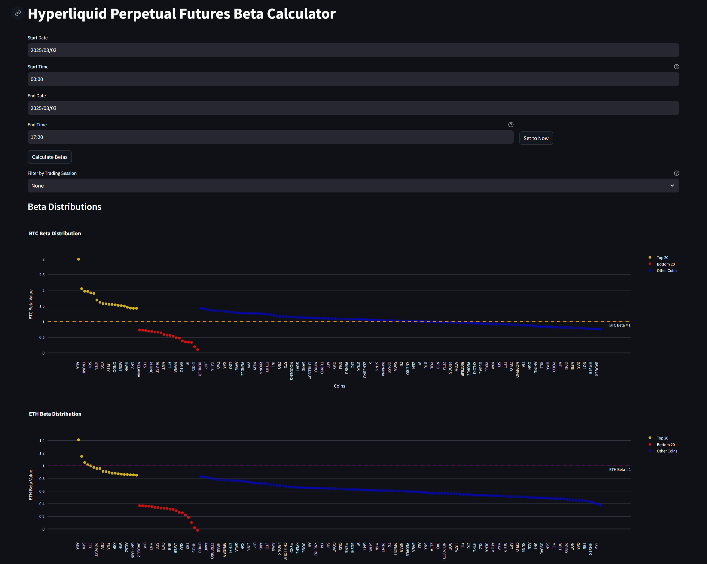

# Beta Analysis Project

This project provides tools to analyze market beta values for crypto tickers (in HyperLiquid DEX). It offers two key features:

1. **Market Beta Analysis**  
   Display market-wide beta analysis that shows the tickers with the highest and lowest beta during a specified period. This view helps identify overall market trends.  
   

2. **Ticker Beta Analysis**  
   Find a specific token’s beta value for a specified time period. This feature allows detailed analysis of a single token's performance.  
   

## Project Structure

- **main.py**  
  The primary script to launch or coordinate beta analysis.

- **src/**  
  Contains core logic for beta calculation and data fetching:
  - **beta_calculator.py**: Calculation logic for beta values.
  - **data_fetcher.py**: Module for fetching market data.
  - **components/**: Contains UI components for displaying analysis (e.g., `MarketBetaAnalysis.js`, `BetaPatternAnalysis.js`).
  - **atoms/**: Contains state management files (e.g., `marketBetaState.js`).

- **run_beta_calculator.bat**  
  A batch script to run the beta calculator.

- **requirements.txt**  
  Lists the project dependencies.

- **market_analysis.png** & **ticker_analysis.png**  
  Screenshots illustrating the two main features.

## Getting Started

1. **Install Dependencies**  
   Ensure you have Python installed. Then install the required packages:
   ```bash
   pip install -r requirements.txt
   ```

2. **Run the Project**  
   You can run the project by executing the batch script:
   ```bash
   run_beta_calculator.bat
   ```
   Alternatively, run the main script:
   ```bash
   python main.py
   ```

## Usage

- **Market Beta Analysis**:  
  Use the market-wide analysis to review which tickers have the most extreme beta values over your chosen period.

- **Ticker Beta Analysis**:  
  Enter a specific token to obtain its beta value for your selected timeframe.

## Additional Information

- The project uses a combination of Python for back-end processing and JavaScript for interactive components.
- Cached data is stored in the `cache/` directory to optimize performance.

This project is designed to help users quickly assess market beta trends and analyze individual token performance over time.
